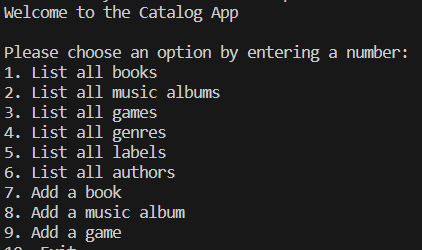

# Ruby-Capstone

<a name="readme-top"></a>
<div align="center">
    
  <br/>
  <h3><b>Ruby Capstone</b></h3>
</div>

# 📗 Table of Contents

- [📖 TDD Project](#tdd-project)
  - [🛠 Built With ](#-built-with-)
    - [Tech Stack ](#tech-stack-)
    - [Key Features ](#key-features-)
  - [💻 Getting Started ](#-getting-started-)
    - [Prerequisites](#prerequisites)
    - [Setup](#setup)
    - [Install](#install)
    - [Usage](#usage)
    - [Run tests](#run-tests)
    - [Deployment](#deployment)
  - [👥 Authors ](#-authors-)
  - [🔭 Future Features ](#-future-features-)
  - [🤝 Contributing ](#-contributing-)
  - [📝 License ](#-license-)

# 📖 Ruby Capstone <a name="about-project">Ruby Capstone</a>

**Ruby-Capstone**

In this project, We create a console app that will help user to keep a record of different types of things their own: books, music albums, and games. Everything will be based on a UML class diagram. The data is stored in JSON files / Also provides a SQL Database model. 

## 🛠 Built With <a name="built-with"></a>
Ruby
### Tech Stack <a name="tech-stack"></a>

<details>
<summary>Backend</summary>
  <ul>
    <li><a href="https://www.ruby-lang.org/es/">Ruby</a></li>
  </ul>
</details>

### Key Features <a name="key-features"></a>

- **Classes requested on UML diagram had been created**
- **Add new books.**
- **Add new music albums.**
- **Add new games.**
- **Save records of authors, labels and genres**
- **Preserve Data in JSON files**
- **Rspec Unit Test"**

<p align="right">(<a href="#readme-top">back to top</a>)</p>


## 💻 Getting Started <a name="getting-started"></a>

To get a local copy up and running, follow these steps.

### Prerequisites

In order to run this project you need:

[Install Ruby](https://www.ruby-lang.org/en/documentation/installation/)

### Setup

```sh
  cd my-folder
  https://github.com/Booze33/Ruby-Capstone.git
```
Run `gem install colorize`
### Install

This project does require additional dependencies. However, it uses RuboCop as a linter and you should set it up as well.

```sh
bundle install
```

```sh
gem install colorize
```

### Usage

To run the project, navigate to the project directory and execute the following command:

```sh
  ruby test.rb
```

### Run tests

To run tests, run the following command:

Run the following command
```sh
rubocop
```

### Deployment

Not available at the moment.

<p align="right">(<a href="#readme-top">back to top</a>)</p>

## Live Demo <a name="demo"></a>

[https://drive.google.com/file/d/1lcHVUuS1c87GpTXkJ6GWEARuSBaS4nFX/view?usp=sharing](https://drive.google.com/file/d/1z3AHJHSdi9sWAMS1ARBFreGRtBK73hQ5/view?usp=sharing)

## 👥 Authors <a name="authors"></a>


👤 **Nabeel Ahmed**
- GitHub: [@Metaverse-Nabeel](https://github.com/Metaverse-Nabeel)
- LinkedIn: [@Nabeel129](https://www.linkedin.com/in/nabeel129/)
- Wellfound(AngelList): [@Nabeel129](https://wellfound.com/u/nabeel-ahmed-62)


👤 **Santiago Munoz**

- GitHub: [@smunoz1988](https://github.com/smunoz1988)
- Twitter: [@twitterhandle](https://twitter.com/Santiag24209785)
- LinkedIn: [LinkedIn](https://www.linkedin.com/in/santiago-munoz-0b2b1a260/)
  

👤 **Tebe Tisloh**

- GitHub: [@Booze33](https://github.com/Booze33)
- Twitter: [@twitterhandle](https://twitter.com/Tebe95645832)
- LinkedIn: [LinkedIn](https://www.linkedin.com/in/tebe-tisloh-847956225)

<p align="right">(<a href="#readme-top">back to top</a>)</p>

## 🔭 Future Features <a name="future-features"></a>

- **Delete items**

<p align="right">(<a href="#readme-top">back to top</a>)</p>

## 🤝 Contributing <a name="contributing"></a>

Contributions, issues, and feature requests are welcome!

<p align="right">(<a href="#readme-top">back to top</a>)</p>

<!-- SUPPORT -->

## ⭐️ Show your support <a name="support"></a>

If you like this project please follow me to find more project of this type in future.

<p align="right">(<a href="#readme-top">back to top</a>)</p>

<!-- ACKNOWLEDGEMENTS -->

## 🙏 Acknowledgments <a name="acknowledgements"></a>

I would like to thank microverse to provide me required information to make this project so far.

<p align="right">(<a href="#readme-top">back to top</a>)</p>

## 📝 License <a name="license"></a>

This project is [MIT](./LICENSE) licensed.

<p align="right">(<a href="#readme-top">back to top</a>)</p>
